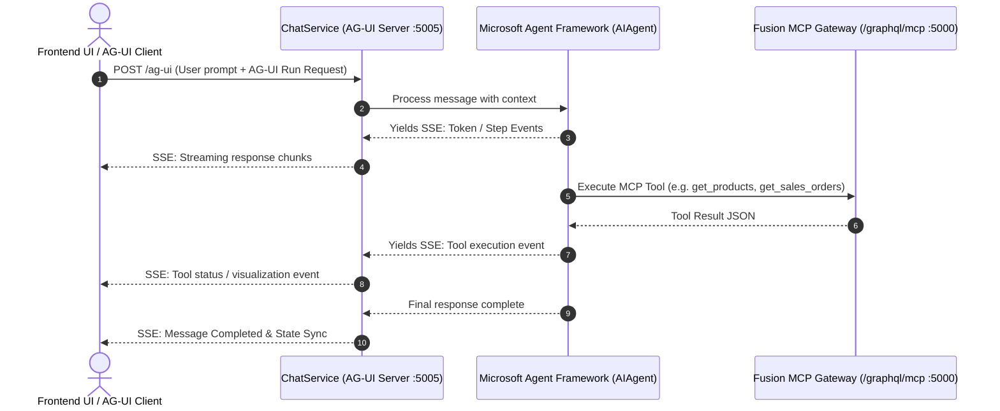

# AI Agent & AG-UI Protocol Architecture

## Overview
The conversational intelligence in `ChatWithYourData.ChatService` is built using **Microsoft Agent Framework** (`Microsoft.Agents.AI` 1.19.0) and communicates with user interfaces via the **AG-UI Protocol** (Agent-User Interaction Protocol) using `Microsoft.Agents.AI.Hosting.AGUI.AspNetCore`.



---

## 1. Microsoft Agent Framework (`Microsoft.Agents.AI` 1.19.0)
- **Agent Architecture**: Uses `ChatClientAgent` configured with enterprise ERP instructions and dynamic tools from the MCP Gateway.
- **Model Support**: Implements `IChatClient` (Microsoft.Extensions.AI) supporting OpenAI, Azure OpenAI, Ollama, and offline/mock clients for testing.
- **MCP Client Integration**: `McpToolProvider` connects to the Fusion Gateway's `/graphql/mcp` endpoint using `ModelContextProtocol` C# SDK (`HttpClientTransport` in SSE mode).
- **Prompt & Context Management**: Enterprise system prompt guides the LLM to route queries across the 4 ERP subgraphs: Inventory, Sales, Procurement, and Finance.

---

## 2. AG-UI Server & Protocol (`Microsoft.Agents.AI.Hosting.AGUI.AspNetCore` 1.19.0-preview)
- **Protocol**: AG-UI over Server-Sent Events (SSE).
- **Endpoint**: `/ag-ui` on port `5005`.
- **Key Capabilities**:
  - **Token Streaming**: Real-time markdown streaming without polling or WebSocket overhead.
  - **Tool Execution Events**: Streams when a tool is triggered, parameters passed, and execution state.
  - **State Synchronization**: Automatically syncs client-side conversation state with backend session records.

---

## 3. Server Configuration & Setup

```csharp
// Program.cs snippet for ChatWithYourData.ChatService.API
var builder = WebApplication.CreateBuilder(args);

builder.WebHost.ConfigureKestrel(options => options.ListenAnyIP(5005));

builder.Services.Configure<AgentOptions>(builder.Configuration.GetSection("Agent"));
builder.Services.AddSingleton<IMcpToolProvider, McpToolProvider>();

builder.Services.AddSingleton<IChatClient>(sp =>
{
    var options = sp.GetRequiredService<IOptions<AgentOptions>>().Value;
    if (!string.IsNullOrWhiteSpace(options.ApiKey))
    {
        return new OpenAIClient(options.ApiKey).GetChatClient(options.Model).AsIChatClient();
    }
    return new MockErpChatClient();
});

builder.Services.AddSingleton<AIAgent>(sp =>
{
    var chatClient = sp.GetRequiredService<IChatClient>();
    var toolProvider = sp.GetRequiredService<IMcpToolProvider>();
    var tools = toolProvider.GetToolsAsync().GetAwaiter().GetResult();

    return new ChatClientAgent(
        chatClient: chatClient,
        name: "ChatWithYourDataERP",
        instructions: "...",
        tools: tools);
});

builder.Services.AddAGUIServer();

var app = builder.Build();

var agent = app.Services.GetRequiredService<AIAgent>();
app.MapAGUIServer("/ag-ui", agent);

app.Run();
```

---

## 4. Endpoints

| Endpoint | Method | Description |
| :--- | :--- | :--- |
| `/ag-ui` | `POST` | AG-UI Protocol SSE endpoint for AI Agent conversation streaming |
| `/health` | `GET` | Service & MCP Gateway health status |
| `/` | `GET` | Service metadata, AG-UI endpoint routes, and registered tool counts |
