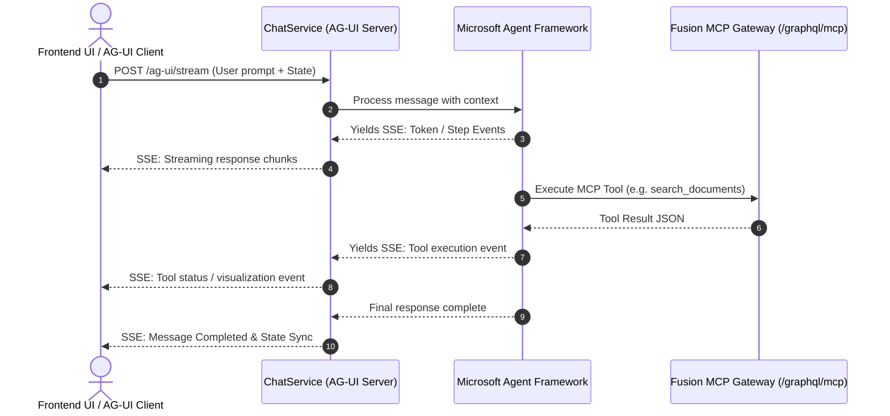

# AI Agent & AG-UI Protocol Architecture

## Overview
The conversational intelligence in `ChatWithYourData.ChatService` is built using **Microsoft Agent Framework** (`Microsoft.Agents.AI`) and communicates with user interfaces via the **AG-UI Protocol** (Agent-User Interaction Protocol).



---

## 1. Microsoft Agent Framework (`Microsoft.Agents.AI`)
- **Reasoning & Planning**: Drives RAG orchestration, multi-step tool calls, and conversation history maintenance.
- **MCP Client Integration**: Connects to the Fusion Gateway's `/graphql/mcp` endpoint to execute backend queries (e.g., semantic search, document fetch, user verification).
- **Prompt & Context Management**: Dynamically compiles system instructions, grounded document chunks, and chat history into agent context.

---

## 2. AG-UI Server & Protocol (`Microsoft.Agents.AI.Hosting.AGUI.AspNetCore`)
- **Protocol**: AG-UI over Server-Sent Events (SSE).
- **Endpoint**: `/ag-ui/stream` (or configured route).
- **Key Protocol Capabilities**:
  - **Token Streaming**: Real-time markdown streaming without polling or WebSocket overhead.
  - **Tool Execution Events**: Streams when a tool is triggered, what parameters were passed, and its execution state for UI badges/visual feedback.
  - **Human-in-the-Loop (HITL)**: Supports confirmation and approval events when performing sensitive actions.
  - **State Synchronization**: Automatically syncs client-side conversation state with backend session records.

---

## 3. Server Configuration Example
```csharp
// Program.cs snippet for ChatWithYourData.ChatService
var builder = WebApplication.CreateBuilder(args);

builder.Services.AddAIAgent(agentBuilder =>
{
    agentBuilder.UseOpenAI(builder.Configuration["OpenAI:ApiKey"]!);
    agentBuilder.AddMcpClient("http://localhost:5000/graphql/mcp");
});

builder.Services.AddAGUISupport();

var app = builder.Build();

app.MapAGUIEndpoint("/ag-ui/stream");

app.Run();
```
