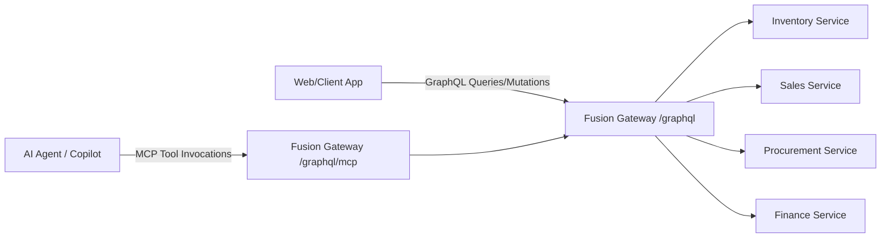

# Gateway & Model Context Protocol (MCP) Architecture

## Overview
The gateway layer acts as the single unified entry point for both human clients (web apps) and AI agent runtimes. It uses **ChilliCream Fusion** to compose microservice subgraphs into a unified GraphQL schema and **ChilliCream MCP Adapter** to expose backend operations as MCP tools.



---

## 1. ChilliCream Fusion Gateway (`ChatWithYourData.Gateway`)
- **Technology**: Hot Chocolate & ChilliCream Fusion (`HotChocolate.Fusion`).
- **Endpoint**: `/graphql` (with Banana Cake Pop UI in development).
- **Federation Strategy**:
  - Subgraphs are defined across the 4 ERP microservices (`InventoryService`, `SalesService`, `ProcurementService`, `FinanceService`).
  - The Gateway composes these schemas into a single unified GraphQL schema package (`gateway.fgp`).
  - Resolves cross-boundary entity references seamlessly.

---

## 2. Model Context Protocol (MCP) Adapter
- **Technology**: `HotChocolate.Fusion.Adapters.Mcp` / `HotChocolate.Adapters.Mcp`.
- **Endpoint**: `/graphql/mcp`
- **Functionality**:
  - Automatically translates selected GraphQL queries and mutations into standard MCP Tools.
  - Generates typed input schemas and tool descriptions directly from GraphQL type definitions.
  - Allows AI agents (such as `ChatService` or external agents) to discover and invoke backend capabilities through the standard MCP protocol without custom API adapters.

---

## 3. Configuration & Startup
```csharp
// Program.cs snippet for ChatWithYourData.Gateway
var builder = WebApplication.CreateBuilder(args);

builder.Services
    .AddFusionGatewayServer()
    .ConfigureFromFile("gateway.fgp")
    .AddMcp(); // Registers MCP support

var app = builder.Build();

app.MapGraphQL();
app.MapGraphQLMcp(); // Exposes /graphql/mcp

app.Run();
```

---

## 4. Registering New MCP Servers & Tools

When adding any new MCP server or exposing new tools to the agent ecosystem:

1. **Document the Endpoint/Transport**: Specify transport type (HTTP SSE, stdio, WebSockets) and URL/command.
2. **Catalog Tool Definitions**:
   - Tool Name (e.g. `search_documents`, `get_user_profile`).
   - Description and use-case rationale.
   - Input schema parameters (required vs optional).
   - Return payload structure.
3. **Update Agent Registration**: Ensure the MCP client in `ChatService` or other consuming agents registers the new server URI so all subsequent sessions can discover and call the new tools.

