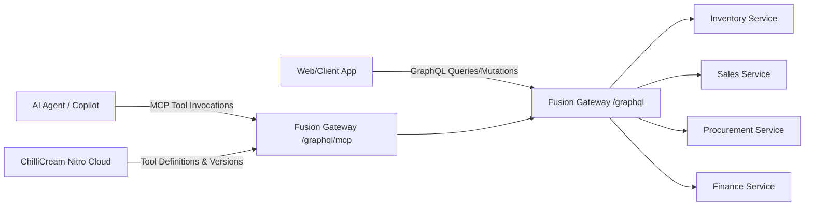

# Gateway & Model Context Protocol (MCP) Architecture

## Overview
The gateway layer acts as the single unified entry point for both human clients (web apps) and AI agent runtimes. It uses **ChilliCream Fusion** to compose microservice subgraphs into a unified GraphQL schema and **ChilliCream MCP Adapter** with **ChilliCream Nitro Cloud** to expose backend operations as MCP tools.



---

## 1. ChilliCream Fusion Gateway (`ChatWithYourData.Gateway`)
- **Technology**: Hot Chocolate & ChilliCream Fusion (`HotChocolate.Fusion.AspNetCore`).
- **Endpoint**: `/graphql` (with Nitro/Banana Cake Pop IDE in development).
- **Federation Strategy**:
  - Subgraphs are defined across the 4 ERP microservices (`InventoryService`, `SalesService`, `ProcurementService`, `FinanceService`).
  - The Gateway composes these schemas into a single unified GraphQL schema package (`gateway.far`).
  - Resolves cross-boundary entity references seamlessly.

---

## 2. Model Context Protocol (MCP) Adapter & Nitro Cloud
- **Technology**: `HotChocolate.Fusion.Adapters.Mcp`, `ChilliCream.Nitro`, `ChilliCream.Nitro.Fusion`.
- **Endpoint**: `/graphql/mcp`
- **Control Plane**:
  - **ChilliCream Nitro Cloud**: Authors, validates, versions, and syncs operation tools directly to the Gateway without manual C# definitions.
  - **Local Fallback (`IMcpStorage`)**: In local development without Nitro credentials, `InMemoryMcpStorage` supplies default ERP tools (`get_products`, `get_sales_orders`, `get_purchase_orders`, `get_invoices`, `adjust_stock`, `create_sales_order`, `create_purchase_order`, `post_journal_entry`).

---

## 3. Configuration & Startup
```csharp
// Program.cs snippet for ChatWithYourData.Gateway
var builder = WebApplication.CreateBuilder(args);

var nitroApiId = builder.Configuration["Nitro:ApiId"];
var nitroApiKey = builder.Configuration["Nitro:ApiKey"];
var nitroStage = builder.Configuration["Nitro:Stage"] ?? "dev";

if (!string.IsNullOrWhiteSpace(nitroApiId) && !string.IsNullOrWhiteSpace(nitroApiKey))
{
    builder.Services
        .AddNitro(o =>
        {
            o.ApiId = nitroApiId;
            o.ApiKey = nitroApiKey;
            o.Stage = nitroStage;
        })
        .AddDefaults();
}

var gatewayBuilder = builder
    .AddGraphQLGateway()
    .AddMcp();

if (string.IsNullOrWhiteSpace(nitroApiId) || string.IsNullOrWhiteSpace(nitroApiKey))
{
    gatewayBuilder.AddMcpStorage<InMemoryMcpStorage>();
}

var app = builder.Build();

app.MapGraphQL();
app.MapGraphQLMcp(); // Exposes /graphql/mcp

app.Run();
```

---

## 4. Nitro Cloud Configuration in `appsettings.json`

```json
{
  "Nitro": {
    "ApiId": "<Your-Nitro-ApiId>",
    "ApiKey": "<Your-Nitro-ApiKey>",
    "Stage": "dev"
  }
}
```

---

### 5. Registering New MCP Servers & Tools

When adding any new MCP server or exposing new tools to the agent ecosystem:

1. **Document the Endpoint/Transport**: Specify transport type (HTTP SSE, Streamable HTTP, stdio) and URL/command.
2. **Catalog Tool Definitions**:
   - Tool Name (e.g. `get_products`, `create_sales_order`).
   - Description and use-case rationale.
   - Input schema parameters (required vs optional).
   - Return payload structure.
3. **Update Agent Registration**: Ensure the MCP client in `ChatService` or other consuming agents registers the new server URI so all subsequent sessions can discover and call the new tools.

---

## 6. Schema Composition & Automation (Dual-Loop)

### A. Local Inner Loop (`scripts/update-gateway.ps1`)
To export fresh schemas from subgraphs and compose the `gateway.far` archive locally:
```powershell
./scripts/update-gateway.ps1
```
This runs:
1. `dotnet tool restore` to ensure `ChilliCream.Nitro.CommandLine` is ready.
2. Extracts live SDL from running services (or uses `./scripts/export-schemas.ps1`).
3. Composes `./src/Gateway/ChatWithYourData.Gateway/gateway.far` using `dotnet nitro fusion compose`.

### B. CI/CD Outer Loop (`.github/workflows/schema-composition.yml`)
On every pull request and push to `main`, GitHub Actions:
1. Builds the entire solution.
2. Exports and composes `gateway.far`.
3. Executes all 24 unit & integration tests.
4. Uploads `gateway.far` as a verified build artifact.

