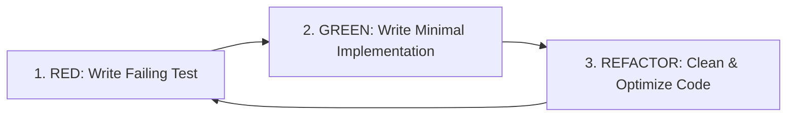

# Test-Driven Development (TDD) & Testing Guidelines

## Overview
All features, handlers, domain logic, and endpoints must be developed following strict **Test-Driven Development (TDD)** using the **Red-Green-Refactor** workflow.

---

## 1. Red-Green-Refactor Cycle



1. **RED**: Write a failing unit or integration test that asserts the expected behavior. Verify that it fails for the right reason.
2. **GREEN**: Write the simplest, cleanest code to make the test pass.
3. **REFACTOR**: Improve design, remove duplication, and optimize without altering behavior. Ensure all tests remain green.

---

## 2. Test Pyramid & Project Layout

```
tests/
└── Services/
    └── <ServiceName>/
        ├── <ServiceName>.UnitTests/
        │   ├── Domain/         # Entity logic, value object invariants
        │   ├── Application/    # CQRS Handlers, Validators, Pipeline behaviors
        │   └── Infrastructure/ # Parsers, mappers, utility classes
        └── <ServiceName>.IntegrationTests/
            ├── Endpoints/      # WebApplicationFactory / GraphQL query execution tests
            └── Persistence/    # EF Core repository queries with SQLite In-Memory
```

---

## 3. Tooling & Stack

| Component | Library / Framework |
| :--- | :--- |
| **Test Runner** | `xUnit` |
| **Assertions** | `FluentAssertions` |
| **Mocking** | `Moq` / `NSubstitute` |
| **Integration Web Host** | `Microsoft.AspNetCore.Mvc.Testing` (`WebApplicationFactory<Program>`) |
| **Database Testing** | SQLite In-Memory (`DataSource=:memory:;Mode=Memory;Cache=Shared`) |

---

## 4. Test Naming & Structure Conventions

- **Method Naming**: `[UnitOfWork]_[Scenario]_[ExpectedOutcome]`
  - Example: `Handle_WhenDocumentIsValid_ReturnsSuccessResultWithDocumentDto()`
  - Example: `UploadDocument_WhenFileIsEmpty_ThrowsValidationException()`
- **AAA Pattern**: Structure tests with explicit `// Arrange`, `// Act`, and `// Assert` sections.
- **Target Framework**: Test projects target `net10.0` with `Microsoft.NET.Test.Sdk`.
